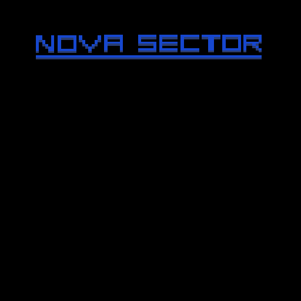

<p align="center">
  
</p>

Space Station 14 content fork. Built on [Robust Toolbox](https://github.com/space-wizards/RobustToolbox).

## Building

```sh
git submodule update --init --recursive
dotnet build
```

See the upstream [Space Wizards docs](https://docs.spacestation14.io/) for engine, content, and contribution guides.

## License

Code is MIT (`LICENSE.TXT`) unless a file header or directory `LICENSE` says otherwise. Non-code assets are CC-BY-SA 3.0 unless otherwise noted in the relevant folder.
